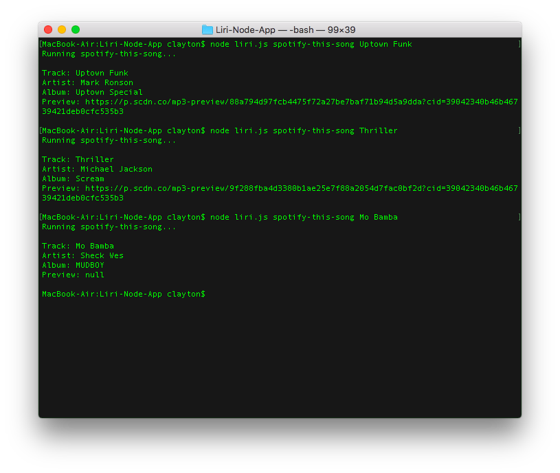
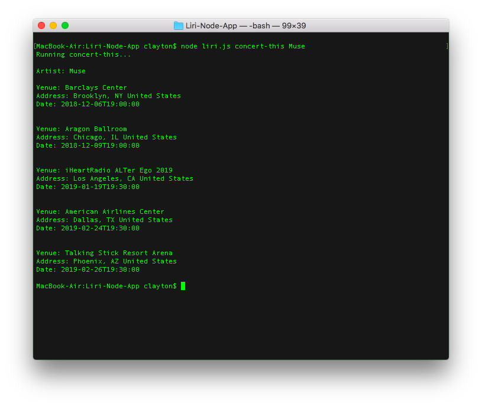
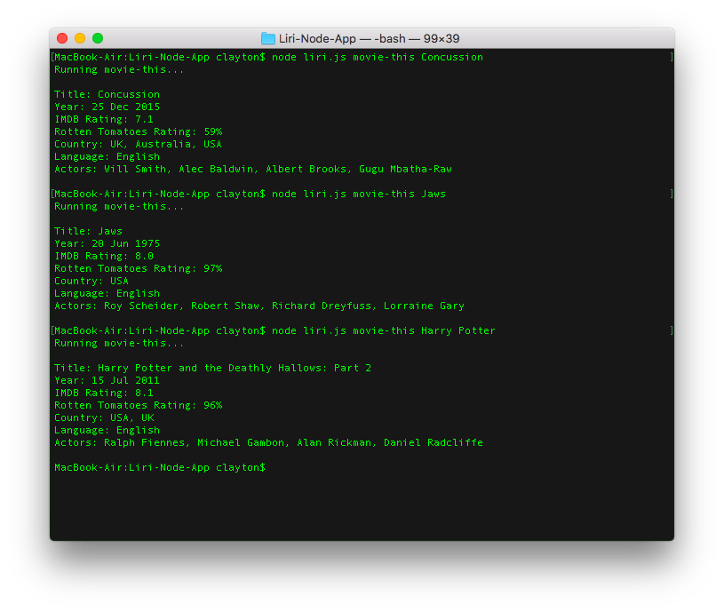
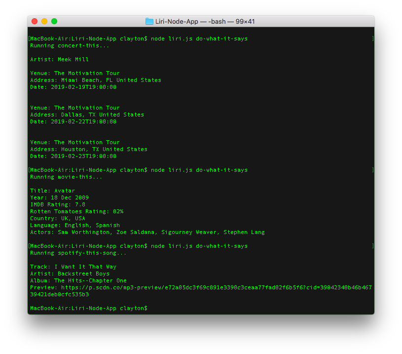

# Liri-Node-App

LIRI (Language Interpretation and Recognition Interface) is a command line node app that takes in parameters and gives you back data. Use LIRI to search Spotify for songs, Bands in Town for concerts, and OMDB for movies.

LIRI accepts the following three commands:
- spotify-this-song (search for a song - the artist, album, and song preview are displayed using the node-spotify-api package)
- concert-this (search for a band - the venue, location, and date are displayed using the Axios package and Bands in Town API)
- movie-this (search for a movie - the year, ratings, language, country, and actors are displayed using the Axios package and OMDB API)
- do-what-it-says (randomly selects and performs a command from the random.txt file)

You can see screenshots of the app in action below:

